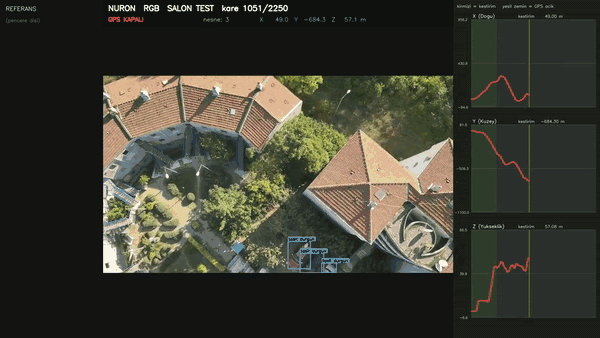
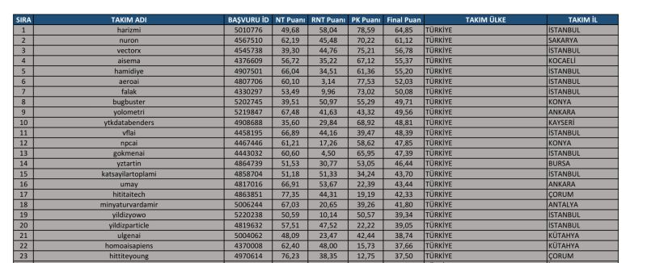
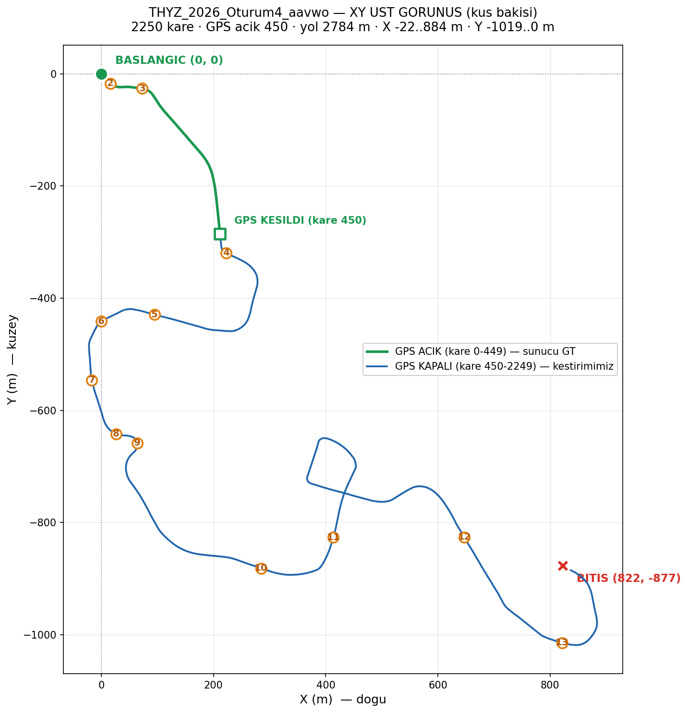
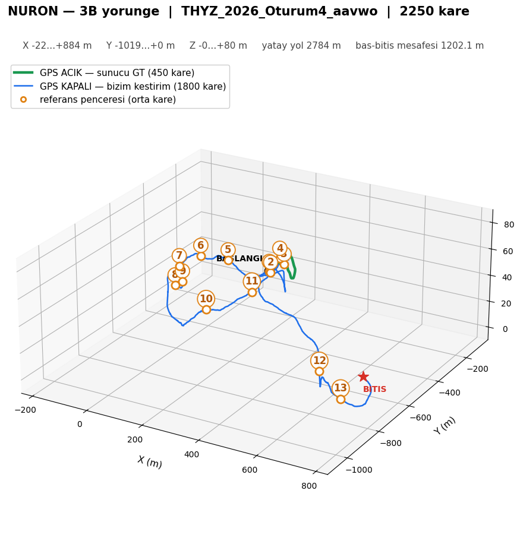
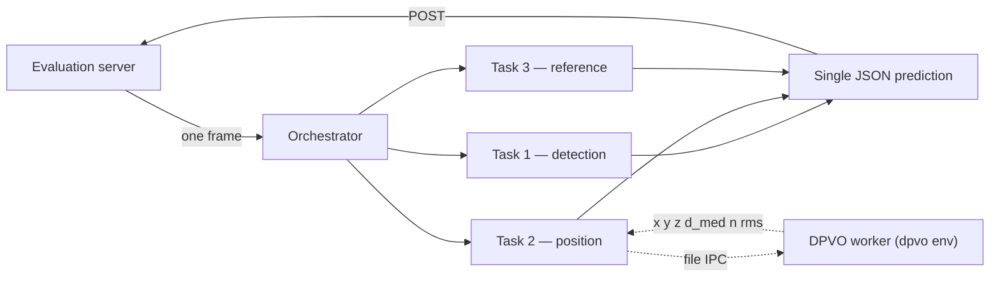

<div align="center">

# NURON

**An integrated perception and GPS-denied positioning system for UAV imagery**

Three competition tasks solved on a single frame stream, on a single 8 GB GPU.

[](https://www.teknofest.org/)
[](#competition-results)
[](LICENSE)
[](#installation)
[](https://huggingface.co/adembtr/nuron-teknofest-2026)



*Live output, competition session 4 — detection, motion state, landing suitability,
reference-object lock and dead-reckoned position, all on one frame stream.*

</div>

---

## What this is

NURON is Team NURON's entry to the **TEKNOFEST 2026 Artificial Intelligence in Aviation**
competition. A UAV flies a course; an evaluation server hands out one frame at a time and
will not release the next frame until a prediction for the current one is posted. Three
tasks must be answered for every frame:

| # | Task | Weight | What NURON does |
|---|---|---|---|
| **1** | Object detection | 25% | YOLO26-L per modality; vehicle motion from background-homography epipolar residuals; landing suitability from PaDiM anomaly + framing + obstacle overlap |
| **2** | GPS-denied positioning | 40% | DPVO visual odometry → Umeyama alignment on the first 450 GT frames → 4-state XY EKF; Z from a separate three-source geometric fusion |
| **3** | Reference-object matching | 25% | HQ-SAM reference crops → embedding bank; FastSAM candidates; C-RADIOv3-H / WebSSL embeddings; margin-based single lock; SAM 2.1 tracking |

A session is **2250 frames over 90 minutes** at 7.5 fps (every 4th frame of a 30 fps
recording) — 300 seconds of flight. The modality (RGB 1920×1080 or thermal 640×512) is
announced at the start of the session. That gives a budget of **2.4 s/frame**; NURON uses
**0.52–0.86 s/frame**, between 22% and 36% of it.

GPS ground truth is available for the **first 450 frames only**. Everything after that is
dead reckoning from imagery alone.

---

## Competition results

### Online qualification — **2nd of 23 teams**

<div align="center">

| Rank | Team | Detection | Reference matching | Positioning | **Final** |
|:---:|---|:---:|:---:|:---:|:---:|
| 1 | harizmi | 49.68 | 58.04 | 78.59 | 64.85 |
| **2** | **nuron** | **62.19** | 45.48 | **70.22** | **61.12** |
| 3 | vectorx | 39.30 | 44.76 | 75.21 | 56.78 |
| 4 | aisema | 56.72 | 35.22 | 67.12 | 55.37 |
| 5 | hamidiye | 66.04 | 34.51 | 61.36 | 55.20 |

*Final = (Detection × 0.25 + Reference × 0.25 + Positioning × 0.40) ÷ 0.90*

</div>

NURON took the **highest detection score** and the **second-highest positioning score**
among the qualifying teams. Reference matching was the weakest sub-score at 45.48 — that
module was subsequently **redesigned from scratch**, which is the v2 pipeline in this
repository (measured 74.9–83.3% recall at >97% precision, see [below](#task-3--reference-object-matching)).

> **Finals results are not yet announced.** This section will be updated when they are.

<details>
<summary>Full qualification table (23 teams)</summary>



</details>

### Session 4 — on-site finals

The best of the four on-site sessions. 2250 frames, **2784 m flown**, GPS available for
the first 450 frames and then cut for the remaining **1800 frames**.

<div align="center">




</div>

| | |
|---|---|
| Frames | 2250 (450 with GPS, 1800 dead-reckoned) |
| Horizontal path flown | 2784 m |
| Extent | X −22…884 m · Y −1019…0 m · Z 0…80 m |
| Start → end | (0, 0) → (822, −877), 1202.1 m apart |
| Reference windows | 13 |

Green is the GPS-anchored calibration leg; blue is NURON's own estimate with no GPS at
all. Full video: [`results/session4/`](results/session4/).

---

## Measured performance

End-to-end against a local replica of the evaluation server, running the complete
pipeline. Errors are mean absolute error in metres **on GPS-denied frames only**.

| Session | GPS anchors | Frames | X | Y | Z | Ref. recall | Ref. precision |
|---|---|---:|---:|---:|---:|---:|---:|
| RGB 2026 | 1400 + 1900 | 1798 | 1.55 | 1.58 | 1.33 | 74.9% | **98.8%** |
| Thermal 2026 (v4) | 1200 + 1600 | 1797 | 2.01 | 1.59 | 2.75 | 83.3% | 97.7% |
| Thermal 2025 s4 (v4) | 1200 + 1600 | 1798 | 1.65 | 1.50 | 1.87 | — | — |

Horizontal error stays **under 1/1000 of the distance flown**. In both runs the server's
deliberately wrong GPS was **never** copied into a prediction (0 frames), and frames with
valid GPS returned ground truth exactly.

**Vehicle motion classification** (accuracy against hand-labelled ground truth):

| Session | v1 | v2 (shipped) |
|---|---|---|
| RGB 2026 (1080p) | 0.946 · 25 FP · 5-frame latency | **0.985 · 5 FP · 1-frame latency** |
| Thermal 2026 | 0.985 · 0/24 moving found | **0.999 · 22/24** |
| RGB 4K (2025 s2 / s3) | 0.832 / 0.757 | **0.921 / 0.939** |

---

## How it works



The server gates on the prediction: frame *n+1* is only released once frame *n* has been
answered. Everything is therefore strictly sequential and latency is the whole game.

### Task 2 — GPS-denied positioning

```
frame → preprocess → DPVO (scale-free trajectory) → Umeyama alignment (first 450, vs GT)
      → anchoring on GPS frames → X, Y, Z
```

XY comes from the learned network. **Z does not use a model at all** — it is pure geometry
(ORB feature pair-distances plus ground sample distance). Three Z sources are fused:

- **A** — ORB scale ratio
- **B** — aligned DPVO z
- **C** — −s · median patch depth

Their prior weights come from a **geometric decision**: the angle between the optical axis
and the ground-plane normal, plus the plane fit residual, classify the view as *nadir+flat*
(0.8 / 0.1 / 0.1) or *oblique* (0.1 / 0.6 / 0.3).

**Three engineering decisions that mattered more than the models:**

<details>
<summary><b>1. Input-size normalisation — the network's intrinsics never depend on the incoming frame size</b></summary>

`scale` used to be a fixed multiplier, so intrinsics stayed the same no matter what
resolution arrived. But K is in pixel units (`fx` = "how many pixels per radian"), so when
the image size changes, `fx, fy, cx, cy` *must* change with it. Halve `fx` and every motion
looks twice as large — the trajectory inflates. Leave `cx` wrong and the projection doesn't
just scale, it **skews**, which no single multiplier can undo.

```
ratio  = W_TARGET / W_incoming
K_dpvo = K_calib × (W_TARGET / W_CALIB)      ← W_incoming never enters
```

Order: undistort at the **incoming** size, resize by a **single** ratio, then feed DPVO
fixed intrinsics. RGB targets 960 px (calibrated at 1920), thermal 640 (calibrated at 640).

**No letterboxing.** DPVO is fully convolutional and doesn't need a fixed canvas — it crops
to a multiple of 16. Padding invents fake edges and corners, and the patch extractor latches
onto them. (YOLO *does* need padding; DPVO does not.) Verified identical K for 320 / 640 /
1280 / 1920 / 3840 inputs, with bit-identical output on 640×512 thermal frames.

</details>

<details>
<summary><b>2. Calibration confidence gate — turning a 982 m failure into 6.4 m</b></summary>

If the first 450 frames are over textureless sea, DPVO's scale collapses. Measured on one
such session: alignment residual 30 m, scale 0.35, and **Z error of 982 m**.

After calibration the estimator checks three things:

| Check | Threshold | Catches |
|---|---|---|
| Alignment residual | > 4 m | geometry that never fitted |
| Scale `s` | outside [5, 400] | scale collapse or blow-up |
| Calibration path length | < 30 m | not enough motion to solve scale |

Fail any one and it drops into **conservative mode**: XY becomes last-known-GT plus damped
velocity (≤ 60 frames), Z holds last-known-GT, and it re-anchors at every GPS event. In all
modes there is a per-frame clamp (3 m XY, 1.5 m Z) and Z may not drift more than 60 m from
the last anchor.

Result on that session: **982 m → 6.4 m**. Healthy sessions have residuals of 0.2–0.6 m, so
the gate never fires on them — the good-session regression is bit-identical.

Honest limit: the gate prevents the catastrophe, it does not rescue the trajectory. XY on
that session is still 38 m / 56 m. With scale-free VO over textureless water, better is not
available.

</details>

<details>
<summary><b>3. Atomic frame handoff — a 9% corrupt-frame rate that cost 322 m</b></summary>

Task 2 runs in a second conda environment (DPVO's CUDA extension is compiled there) and
frames cross the process boundary as files. A plain write let the reader open a **partially
written JPEG**: 9% of frames came back corrupt, and the resulting 3D error was **322 m**.

Switching the handoff to write-then-`os.replace` — an atomic rename — took the corrupt rate
to **zero** and the error with it. No model changed.

</details>

### Task 1 — detection, motion and landing suitability

YOLO26-L per modality with class-based confidence thresholds and duplicate-box suppression
(IoU > 0.8). Vehicle motion is decided by estimating the **background homography** between
frames and decomposing the epipolar residual into perpendicular and along-track components,
with an edge-safe anchor so a vehicle entering the frame doesn't register as moving from its
growing box alone. Landing suitability combines a **PaDiM** (ResNet18 Mahalanobis) anomaly
score with a framing check and obstacle overlap.

```
0 = vehicle   1 = person   2 = UAP (landing zone)   3 = UAI (non-landing zone)

landing_status : 0 unsuitable · 1 suitable · -1 not a landing area   (UAP/UAI only)
motion_status  : 0 stationary · 1 moving    · -1 not a vehicle       (vehicles only)
```

### Task 3 — reference-object matching

At session start the server supplies reference images. HQ-SAM crops the object out of each
one and the crops become an embedding bank. Per frame, FastSAM proposes candidates which are
grown by contact, embedded with **C-RADIOv3-H** (colour) or **WebSSL DINO-300M** (grayscale),
and matched against the bank. A **margin rule** decides the lock: unless the best candidate
beats the runner-up by a margin, **no box is emitted at all**.

That rule is why precision (>97%) runs well ahead of recall (74.9–83.3%) — wrong boxes are
penalised, missing ones merely score nothing, so staying quiet when uncertain is correct.
Once locked, DAM4SAM (SAM 2.1) tracks the object.

### Running two heavy processes on one 8 GB GPU

The thermal Task 3 hybrid path loads two embedding backbones and peaks at ~5.7 GB, while the
DPVO worker wants another 1.9–2.9 GB on the same card. They did not fit: 607 of 980 frames
threw `CUDA out of memory` and YOLO never ran at all.

Two switches fixed it **without touching any decision logic** — `NURON_PADIM_DEVICE=cpu`
moves the landing PaDiM to CPU (it only runs when a UAP/UAI box exists, so it costs ~50 ms on
those frames, and the output is identical), and `NURON_TERMAL_K=1` gives the worker a single
DPVO instance. Together: client ~4.6 GB + worker ~1.3 GB ≈ 5.9 GB, no OOM. A file-based GPU
queue (`src/common/gpu_kuyruk.py`) arbitrates between the two processes.

**Start order matters on thermal**: server → client → worker, so the client places its heavy
models first.

---

## Installation

**Requirements:** Ubuntu 22.04 · NVIDIA GPU (≥ 8 GB) · CUDA 12.x · conda

Two environments are needed, because DPVO's CUDA extension (`cuda_corr`) is compiled
separately:

```bash
# base — Tasks 1 and 3, plus the server interface
conda create -n nuron python=3.13 -y && conda activate nuron
pip install -r connect/requirements.txt

# dpvo — Task 2 only
conda create -n dpvo python=3.11 -y && conda activate dpvo
pip install torch torchvision --index-url https://download.pytorch.org/whl/cu121
git clone https://github.com/princeton-vl/DPVO third_party/dpvo_repo
cd third_party/dpvo_repo && pip install -e . && cd ../..
```

> **DPVO patch.** NURON changes one line in `dpvo/dpvo.py` (patch-depth initialisation
> `rand_like` → `ones_like`) for a deterministic start. See [`docs/MODELS.md`](docs/MODELS.md).

Then fetch the weights — see [Model weights](#model-weights) — and configure:

```bash
cp connect/config/example.env connect/config/.env
# edit TEAM_NAME, PASSWORD and EVALUATION_SERVER_URL
```

### Running

Two consoles. On RGB the start order is free; **on thermal start the interface first, then
the worker.**

```bash
# console 1 — Task 2 worker  (MUST be the dpvo env)
conda activate dpvo && python scripts/gps_worker.py --modality rgb

# console 2 — main interface
conda activate nuron && NURON_MODALITY=rgb python -m connect.main
```

<details>
<summary>Environment switches</summary>

| Variable | Default | Effect |
|---|---|---|
| `NURON_MODALITY` | `rgb` | `rgb` or `termal` |
| `NURON_PADIM_DEVICE` | `cuda` | `cpu` moves landing PaDiM off the GPU (identical output) |
| `NURON_TERMAL_K` | `1` | DPVO instances in the thermal worker |
| `NURON_TERMAL_V4` | `1` | `0` reverts to the v1 thermal estimator, bit-for-bit |
| `NURON_TERMAL_HIBRIT` | `1` | `0` uses the older thermal-only Task 3 path |
| `NURON_GPS_ROOT`, `NURON_SERVER_ROOT` | — | dataset roots for the offline test scripts |

Every switch defaults to the measured, shipped behaviour.

</details>

---

## Model weights

**This repository contains code only — no weights.** Everything below belongs in `models/`,
which is git-ignored.

### Trained by Team NURON

Hosted on HuggingFace: **[`adembtr/nuron-teknofest-2026`](https://huggingface.co/adembtr/nuron-teknofest-2026)**

```bash
pip install huggingface_hub
hf download adembtr/nuron-teknofest-2026 --local-dir models/
```

The layout on HuggingFace already matches what the code expects.

| File | Task | Architecture |
|---|---|---|
| `rgb_yolo.pt` · `termal_yolo.pt` | 1 | YOLO26-L, 4 classes, one per modality |
| `rgb_padim_uap/` · `rgb_padim_uai/` | 1 | PaDiM (ResNet18), 2-model ensemble each |
| `termal_padim_uap.pth` · `termal_padim_uai.pth` | 1 | PaDiM (ResNet18) |

### Public checkpoints — download from the original authors

These are unmodified third-party weights. NURON did not train them.

| File | Source |
|---|---|
| `rgb_dpvo.pth`, `termal_dpvo.pth` | [DPVO](https://github.com/princeton-vl/DPVO) — the *same* file; thermal differs only in preprocessing and config |
| `sam_hq_vit_l.pth` | [HQ-SAM](https://github.com/SysCV/sam-hq) |
| `rgb_fastsam_x.pt` | [FastSAM](https://github.com/CASIA-IVA-Lab/FastSAM) |
| `rgb_radio_v3h.pth.tar` + `radio_repo/` | [NVIDIA C-RADIOv3-H](https://github.com/NVlabs/RADIO) — local hub copy for offline loading |
| `webssl_dino300m_light2b/` | [Meta WebSSL DINO-300M](https://huggingface.co/facebook/webssl-dino300m-full2b-224) |
| `sam2.1_hiera_large.pt`, `sam2.1_hiera_base_plus.pt` | [SAM 2.1](https://github.com/facebookresearch/sam2) — large for RGB, base_plus for thermal |

Full layout, checksums and naming rules: [`docs/MODELS.md`](docs/MODELS.md).

---

## Repository layout

```
connect/              official TEKNOFEST team-interface (protocol preserved verbatim)
src/
  client/             orchestrator, API client, base↔dpvo bridge (file IPC)
  common/             config, runtime, GPU queue, schema
  task1_detection/    detector · motion · landing · pipeline
  task2_position/     aligner · dpvo_runner · estimators · paths
  task3_reference/    embedding bank, candidates, lock, tracking (rgb2 / termal2 / termal3)
scripts/              gps_worker (dpvo env) · offline tests · e2e
config/               calibration, competition constants, estimator parameters
results/              session 4 video and trajectory plots
docs/                 architecture, models, competition protocol
```

`connect/` is the organisers' official interface. The protocol — auth, frame gating,
resume, rate limiting — is untouched; only `connect/iface/object_detection_model.py` and
`connect/main.py` are wired to NURON.

---

## Known limits

Measured, located, and stated plainly.

- **Thermal north axis** carries an 11.78 m systematic error in one session, from monocular
  scale inflation on the climb leg. It shrinks as GPS anchor count rises.
- **The vertical axis is sensitive to anchor timing** — the same session gives 1.33 m or
  3.93 m depending on where the last anchor falls. A 650-frame gap with no anchor is the
  bad case.
- **Textureless surfaces (open sea)** break scale-free VO. The confidence gate prevents the
  982 m catastrophe but cannot reconstruct the trajectory.
- **Measurement coverage is incomplete** — manual reference labels exist for only 7 of 10
  RGB windows and 6 of 11 thermal windows.
- **Error is not random.** It clusters in specific flight legs, which makes it systematic
  scale drift, and therefore workable.

---

## Licence

NURON's own code is released under the [Apache License 2.0](LICENSE).

> **Note on third-party licences.** The pipeline depends on Ultralytics YOLO, which is
> **AGPL-3.0**. That licence governs the YOLO-derived components and the checkpoints trained
> with them. Other dependencies carry their own terms — see
> [`THIRD_PARTY_LICENSES.md`](THIRD_PARTY_LICENSES.md) before redistributing or deploying
> commercially.

Competition data, reference imagery and the evaluation server belong to TEKNOFEST and are
**not** redistributed here.

## Team

**NURON** — Sakarya, Türkiye
Adem Batur (captain) · Batuhan Özkan

## Citation

```bibtex
@software{nuron2026,
  title  = {NURON: An Integrated Perception and GPS-Denied Positioning System for UAV Imagery},
  author = {Batur, Adem and {\"O}zkan, Batuhan},
  year   = {2026},
  url    = {https://github.com/adembtr/nuron-teknofest-2026},
  note   = {TEKNOFEST 2026 Artificial Intelligence in Aviation}
}
```
